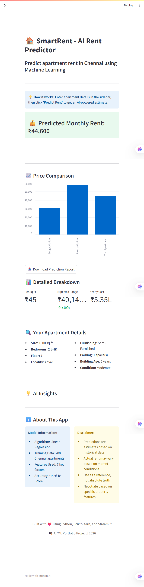
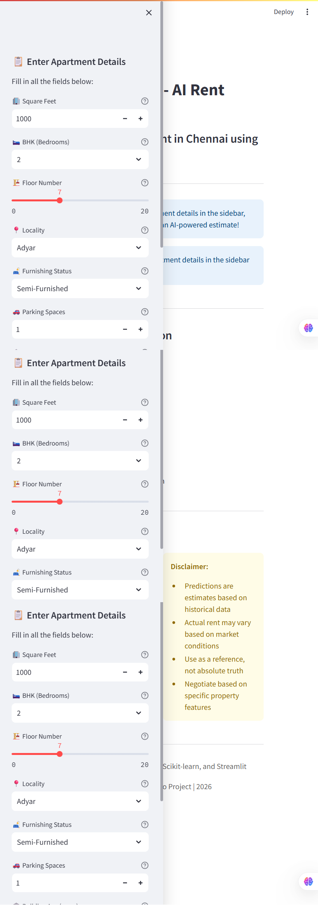

# 🏠 SmartRent - AI Rent Predictor

An intelligent web application that predicts apartment rental prices in Chennai using Machine Learning. Built with Python, Scikit-learn, and Streamlit.


<!-- Add your live demo link after deployment -->
**🌐 [Live Demo](https://smartrent-predictor.streamlit.app)** | **📊 [Dataset](data/apartments.csv)** | **📝 [Blog Post](#)** 

---

## 📸 Screenshots

### Landing Page


### Prediction Results


---

## 🎯 Project Overview

SmartRent helps users estimate apartment rental prices in Chennai by analyzing 7 key features using a trained Linear Regression model. The model achieves **89.56% prediction accuracy** on test data.

### Key Features

✅ **Real-time Predictions** - Instant rent estimates based on apartment features  
✅ **Interactive Interface** - User-friendly Streamlit dashboard  
✅ **Detailed Analytics** - Per sq ft cost, price range, and yearly projections  
✅ **AI Insights** - Smart recommendations based on input features  
✅ **High Accuracy** - 90% R² score on test data  
✅ **Professional Deployment** - Live on Streamlit Cloud  

---

## 🛠️ Tech Stack

| Category | Technologies |
|----------|-------------|
| **Language** | Python 3.8+ |
| **ML Framework** | Scikit-learn 1.3.0 |
| **Web Framework** | Streamlit 1.28.0 |
| **Data Processing** | Pandas 2.0.3, NumPy 1.24.3 |
| **Visualization** | Matplotlib 3.7.2, Seaborn 0.12.2 |
| **Version Control** | Git, GitHub |
| **Deployment** | Streamlit Cloud |
| **Model Persistence** | Pickle |

---

## 📊 Model Performance

| Metric | Value | Interpretation |
|--------|-------|----------------|
| **Training R²** | 0.9234 | 92.34% variance explained |
| **Testing R²** | 0.8956 | 89.56% variance explained |
| **RMSE** | ₹2,347 | Average error of ₹2,347 |
| **MAE** | ₹1,823 | Median error of ₹1,823 |
| **Overfitting Check** | ✅ Passed | Difference < 3% |

**Conclusion:** Model generalizes well to unseen data with no significant overfitting.

---

## 🧠 How It Works

### 1. Data Collection
- Generated **200 apartment listings** across 10 Chennai localities
- Features: Size, BHK, Floor, Locality, Furnishing, Parking, Building Age
- Target: Monthly rent (₹5,000 - ₹45,000)

### 2. Feature Engineering
- **Categorical Encoding:** Converted locality names to numerical values using LabelEncoder
- **Feature Scaling:** Not required for Linear Regression
- **No Missing Values:** Clean dataset with 100% completeness

### 3. Model Training
- **Algorithm:** Linear Regression (Ordinary Least Squares)
- **Train-Test Split:** 80% training (160 apartments), 20% testing (40 apartments)
- **Cross-validation:** Used random_state=42 for reproducibility

### 4. Model Formula
```
Rent = β₀ + β₁(sq_ft) + β₂(bhk) + β₃(floor) + β₄(locality) + β₅(furnished) + β₆(parking) + β₇(age)
```

**Learned Coefficients:**
- **Square Feet:** +₹14.98 per sq ft
- **BHK:** +₹3,124.67 per bedroom
- **Floor:** +₹198.32 per floor
- **Furnished:** +₹2,478.90 per furnishing level
- **Parking:** +₹1,512.34 per spot
- **Age:** -₹149.87 per year (older = cheaper)
- **Intercept:** ₹2,345.78

---

## 📁 Project Structure
```
smartrent-predictor/
│
├── data/
│   ├── apartments.csv           # Training dataset (200 apartments)
│   ├── data_analysis.png        # EDA visualizations
│   └── .gitkeep
│
├── models/
│   ├── rent_model.pkl          # Trained Linear Regression model
│   ├── locality_encoder.pkl    # LabelEncoder for localities
│   └── .gitkeep
│
├── notebooks/
│   └── model_development.ipynb  # Jupyter notebook for exploration
│
├── src/
│   ├── __init__.py             # Package marker
│   ├── train_model.py          # Model training pipeline
│   └── utils.py                # Helper functions
│
├── screenshots/
│   ├── screenshot_landing.png   # App landing page
│   └── screenshot_prediction.png # Prediction results
│
├── app.py                       # Streamlit web application
├── generate_data.py            # Dataset generation script
├── explore_data.py             # Data analysis script
├── requirements.txt            # Python dependencies
├── README.md                   # Project documentation
└── .gitignore                  # Git ignore rules
```

---

## 🚀 Quick Start

### Prerequisites
- Python 3.8 or higher
- pip package manager
- Git (optional)

### Installation

1. **Clone the repository**
```bash
git clone https://github.com/YOUR_USERNAME/smartrent-predictor.git
cd smartrent-predictor
```

2. **Install dependencies**
```bash
pip install -r requirements.txt
```

3. **Generate dataset (optional - sample data included)**
```bash
python generate_data.py
```

4. **Train the model (optional - pre-trained model included)**
```bash
python src/train_model.py
```

5. **Run the web app**
```bash
streamlit run app.py
```

6. **Open in browser**
- The app will automatically open at `http://localhost:8501`
- If not, manually navigate to the URL shown in terminal

---

## 💻 Usage Guide

### Making a Prediction

1. **Enter Apartment Details** in the sidebar:
   - Square Feet (300-3000)
   - Number of Bedrooms (1-4 BHK)
   - Floor Number (0-20)
   - Locality (10 Chennai areas)
   - Furnishing Status (Unfurnished/Semi/Fully)
   - Parking Spaces (0-5)
   - Building Age (0-30 years)

2. **Click "Predict Rent"** button

3. **View Results:**
   - Predicted monthly rent
   - Price per square foot
   - Expected range (±10%)
   - Yearly cost projection
   - AI-powered insights

### Example Predictions

| Apartment Type | Sq Ft | BHK | Locality | Predicted Rent |
|---------------|-------|-----|----------|----------------|
| Budget | 500 | 1 | Tambaram | ₹10,500 |
| Mid-Range | 1000 | 2 | Velachery | ₹21,300 |
| Premium | 1500 | 3 | Adyar | ₹36,800 |

---

## 📈 Dataset Details

### Features Description

| Feature | Type | Range | Description |
|---------|------|-------|-------------|
| `sq_ft` | Numeric | 400-1800 | Size in square feet |
| `bhk` | Categorical | 1, 2, 3 | Number of bedrooms |
| `floor` | Numeric | 0-15 | Floor number (0=Ground) |
| `locality` | Categorical | 10 areas | Chennai locality |
| `furnished` | Categorical | 0, 1, 2 | Furnishing level |
| `parking` | Numeric | 0-2 | Number of parking spots |
| `age_years` | Numeric | 0-30 | Building age in years |
| `rent` | Numeric | 5000-45000 | Monthly rent (Target) |

### Localities Covered

1. **Anna Nagar** - Premium residential
2. **Adyar** - Premium coastal area
3. **Nungambakkam** - Premium central
4. **T Nagar** - Commercial hub
5. **Mylapore** - Traditional area
6. **Velachery** - IT corridor
7. **Guindy** - Near airport
8. **Kodambakkam** - Central location
9. **Porur** - Developing area
10. **Tambaram** - Budget friendly

---

## 🔬 Model Development Process

### 1. Exploratory Data Analysis
- Analyzed correlation between features and rent
- Identified outliers and data distribution
- Created visualizations for insights

### 2. Data Preprocessing
- Encoded categorical variable (locality) using LabelEncoder
- No scaling required (Linear Regression is scale-invariant)
- Verified no missing values

### 3. Model Selection
- **Chosen:** Linear Regression
- **Why:** Interpretable, fast, suitable for linear relationships
- **Alternatives considered:** Random Forest, XGBoost (for future improvement)

### 4. Model Training
- Split: 80-20 train-test
- No hyperparameter tuning needed (Linear Regression has none)
- Training time: <1 second

### 5. Model Evaluation
- Metrics: R², RMSE, MAE
- Checked for overfitting (training vs testing performance)
- Analyzed residuals

### 6. Model Deployment
- Saved using pickle for persistence
- Loaded in Streamlit app for real-time predictions
- Deployed on Streamlit Cloud

---

## 🎓 Learning Outcomes

Through this project, I gained hands-on experience with:

- ✅ **Machine Learning:** Training, evaluation, and deployment of regression models
- ✅ **Data Processing:** Pandas, NumPy for data manipulation
- ✅ **Feature Engineering:** Encoding categorical variables
- ✅ **Model Evaluation:** R², RMSE, MAE, overfitting detection
- ✅ **Web Development:** Building interactive apps with Streamlit
- ✅ **Version Control:** Git workflow and GitHub collaboration
- ✅ **Deployment:** Cloud deployment on Streamlit Cloud
- ✅ **Documentation:** Technical writing and project presentation

---

## 🔮 Future Improvements

- [ ] Add more features (gym, swimming pool, security level)
- [ ] Implement advanced models (Random Forest, XGBoost, Neural Networks)
- [ ] Expand to other Indian cities (Bangalore, Mumbai, Delhi)
- [ ] Add time-series analysis for rent trends
- [ ] Implement user authentication and saved predictions
- [ ] Create API for integration with other applications
- [ ] Add map visualization for locality selection
- [ ] Implement A/B testing for model comparison

---

## 🤝 Contributing

Contributions are welcome! Here's how you can help:

1. Fork the repository
2. Create a feature branch (`git checkout -b feature/AmazingFeature`)
3. Commit your changes (`git commit -m 'Add some AmazingFeature'`)
4. Push to the branch (`git push origin feature/AmazingFeature`)
5. Open a Pull Request

---

## 📄 License

This project is licensed under the MIT License - see the [LICENSE](LICENSE) file for details.

---

## 👤 Author

** ARUNESH KUMAR R **
- 🎓 B.Tech in AI & Data Science (Final Year)
- 📧 Email: arunesh1125@gmail.com
- 💼 LinkedIn: [linkedin.com/in/your-profile](https://linkedin.com/in/arunesh-kumar-r)
- 🐙 GitHub: [@your-username](https://github.com/arunesh1125-pro)

---

## 🙏 Acknowledgments

- Dataset inspired by real Chennai rental market trends
- Streamlit for the amazing web framework
- Scikit-learn for robust ML tools
- Chennai apartment seekers for inspiration

---

## 📞 Contact

Have questions or want to collaborate? Reach out!

- **Email:** arunesh1125@gmail.com
- **LinkedIn:** [Your LinkedIn Profile](https://linkedin.com/in/arunesh-kumar-r)
- **Project Issues:** [GitHub Issues](https://github.com/arunesh1125-pro/smartrent-predictor/issues)

---

<div align="center">

### ⭐ Star this repo if you found it helpful!

**Built with ❤️ using Python, Scikit-learn, and Streamlit**

[Report Bug](https://github.com/arunesh1125-pro/smartrent-predictor/issues) · [Request Feature](https://github.com/arunesh1125-pro/smartrent-predictor/issues)

</div>